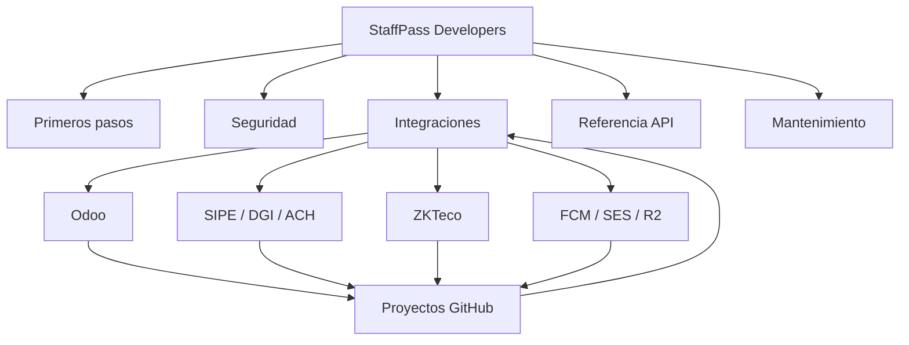

## Jerarquía del portal

```text
Inicio (/)
├── Primeros pasos (/getting-started)
├── Activación Enterprise (/enterprise-activation)
├── Seguridad (/security/*)
│   ├── Autenticación
│   ├── Permisos
│   ├── Errores
│   └── Límites
├── Integraciones (/integrations/*)
│   ├── Estado
│   ├── Proyectos
│   ├── Plantilla de repositorios
│   ├── Asistencia y ZKTeco
│   ├── Contabilidad y Odoo
│   └── Planilla, SIPE, DGI y ACH
├── Referencia API (/api-reference/*)
│   ├── OpenAPI
│   └── Ejemplos
└── Mantenimiento (/maintenance/*)
    ├── Versionado
    ├── Arquitectura de información
    ├── Evaluación de hosting
    └── Checklist de publicación
```

## Mapa visual



## Mapa de URLs

| Página | URL | Padre | Navegación | Prioridad |
| --- | --- | --- | --- | --- |
| Inicio | `/` | — | Principal | Alta |
| Primeros pasos | `/getting-started` | Inicio | Sidebar | Alta |
| Activación Enterprise | `/enterprise-activation` | Inicio | Sidebar | Alta |
| Estado de integraciones | `/integrations/status` | Integraciones | Sidebar y enlaces contextuales | Alta |
| Proyectos | `/integrations/projects` | Integraciones | Sidebar | Alta |
| Plantilla | `/integrations/repository-blueprint` | Integraciones | Sidebar | Media |
| Referencia | `/api-reference/overview` | Referencia API | Sidebar | Alta cuando exista API |
| Versionado | `/maintenance/versioning` | Mantenimiento | Sidebar | Media |

## Navegación

- La navegación principal conserva cinco grupos: inicio, seguridad,
  integraciones, referencia y mantenimiento.
- `Estado de integraciones` es el hub operativo y enlaza cada guía de proveedor.
- `Proyectos` es el directorio de repositorios; cada repositorio enlaza de vuelta
  al hub y a su guía específica.
- La referencia API permanece visible para explicar su indisponibilidad, pero
  no incluye playground ni servidor hasta tener operaciones autorizadas.

## Enlaces internos

- Toda guía de proveedor enlaza a `Estado`, `Proyectos` y `Activación Enterprise`.
- Todo README de repositorio enlaza a su guía canónica y al estado vigente.
- Los cambios de versión enlazan al changelog del proyecto y a OpenAPI.
- Ninguna página puede quedar huérfana; `validate.mjs` comprueba que toda página
  de navegación exista y se ampliará para verificar backlinks al crear repos.
